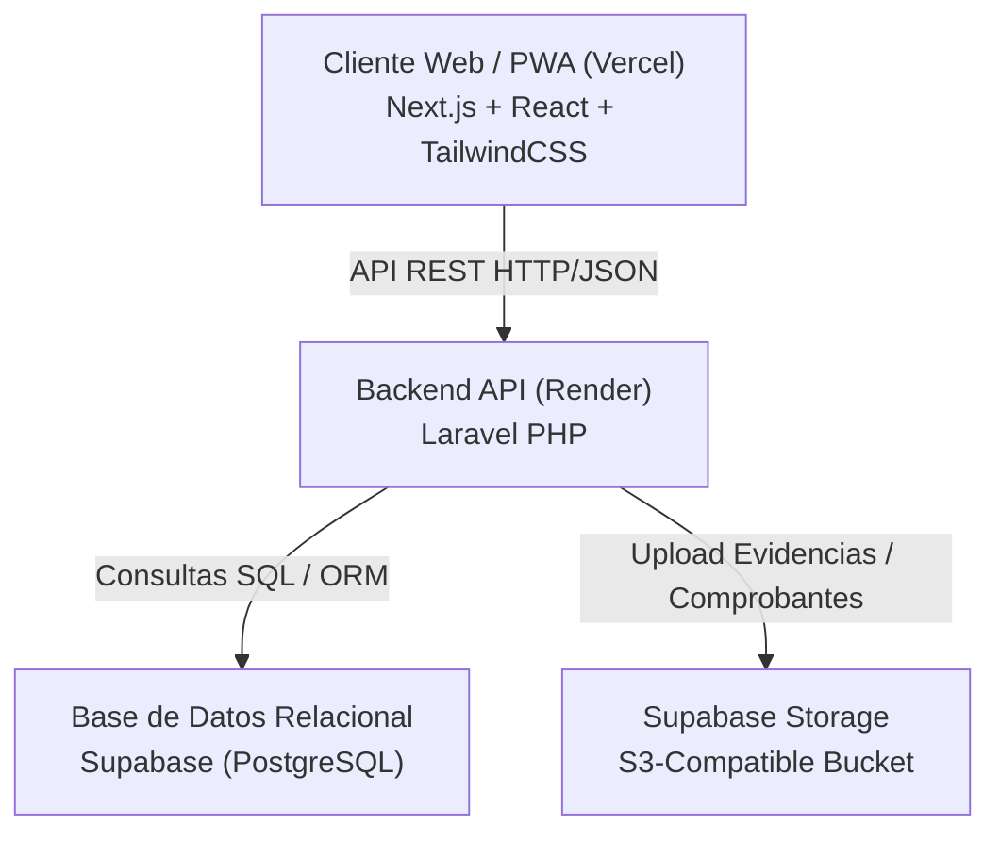

# 🎓 UniRent - Plataforma P2P de Alquiler Universitario

> **Alquila lo que necesitas, gana dinero con lo que no usas.**  
> UniRent es una plataforma de economía colaborativa Peer-to-Peer (P2P) diseñada exclusivamente para conectar a la comunidad universitaria (UPAO), permitiendo el alquiler seguro de herramientas de estudio, calculadoras científicas/financieras, libros y equipos audiovisuales a precios accesibles.

---

## 🌐 Enlaces de Despliegue en Producción

* 🚀 **Landing Page Comercial:** [https://unirent-upao.vercel.app/](https://unirent-upao.vercel.app/)
* 🛒 **Marketplace PWA:** [https://unirent-upao.vercel.app/marketplace](https://unirent-upao.vercel.app/marketplace)
* 📜 **Términos y Condiciones Legales:** [https://unirent-upao.vercel.app/terms](https://unirent-upao.vercel.app/terms)
* ⚡ **Backend API REST (Render):** `https://nextus-api.onrender.com/api`
* 📦 **Repositorio Oficial:** [https://github.com/Cesar-Sanchez-sof/UniRent.git](https://github.com/Cesar-Sanchez-sof/UniRent.git)

---

## ✨ Características Principales & Reglas de Negocio

### 1. 🔒 Validación KYC Institucional
* Registro de usuarios restringido mediante **DNI (8 dígitos)**, **Código Universitario** y **Correo Institucional (`@upao.edu.pe`)**.
* Verificación de identidad para garantizar un entorno cerrado, transparente y seguro entre pares.

### 2. 📱 Experiencia PWA & Redirección Inteligente
* **Landing Page Comercial (`/`):** Embudo de conversión con propuesta de valor bidireccional (*Ahorra* / *Gana dinero*), categorías y testimonios.
* **Acceso PWA Directo (`/marketplace`):** Al instalar la App en el teléfono (modo *standalone*), la plataforma detecta el entorno y redirige automáticamente al catálogo principal del Marketplace.

### 3. 🛡️ Límite de Tarifas y Artículos Prohibidos
* **Límite Máximo de Tarifa:** El precio de alquiler por día no puede superar los **S/ 200 soles**.
* **Artículos Prohibidos:** Queda estrictamente prohibida la publicación o alquiler de Laptops, Tablets o bienes de alto valor patrimonial para mitigar riesgos de robos de mayor impacto.

### 4. ⚖️ Sistema de Gobernanza y 3 Infracciones (Strikes)
* **Política de 3 Strikes:** Acumular tres (3) Infracciones por retraso en devoluciones, calificaciones bajas (< 3.0) o maltrato verbal resulta en la **suspensión permanente** de la cuenta.
* **Investigación Administrativa & Deuda:** Ante reportes de daños o pérdidas, la administración realiza una investigación de evidencias y genera una deuda formal al usuario agraviador para restituir el bien al dueño.

### 5. ⚖️ Libro de Reclamaciones e Incidencias (General y Específico)
* Acceso directo desde el footer para ingresar reclamos formales del servicio en general o incidencias específicas ligadas a un alquiler activo o completado.
* Soporte para adjuntar imágenes de evidencias que se almacenan directamente en el bucket de Supabase (S3).

### 6. 💰 Autoliquidación de Deudas y Validación del Administrador
* Sistema interactivo para reportar pagos de comisiones (deuda > 0) adjuntando monto, número de operación y la captura del comprobante.
* Notificación en tiempo real para todos los administradores ante cada nuevo pago reportado.
* Ficha de aprobación donde el administrador puede verificar la transacción y autorizar el reinicio de la deuda a S/ 0 de forma automática.

### 7. ⭐ Sistema de Confianza Bidireccional
* **Calificación Mutua:** Transacción calificada tanto por el cliente (hacia el dueño) como por el dueño (hacia el arrendatario), promediando los puntajes en tiempo real.

---

## 🛠️ Arquitectura y Stack Tecnológico



* **Frontend:** Next.js (App Router), React, TailwindCSS, Lucide React Icons (Desplegado en **Vercel**).
* **Backend:** API REST en Laravel PHP (Desplegado en **Render**).
* **Base de Datos:** PostgreSQL administrado en **Supabase**.
* **Almacenamiento Cloud:** **Supabase Storage (S3 API)** para imágenes de productos, evidencias de reclamos y comprobantes de pagos.

---

## 📂 Estructura de Rutas del Proyecto (Next.js App Router)

```
app/
├── page.tsx            # Landing Page Comercial
├── marketplace/
│   └── page.tsx        # Catálogo principal PWA del Marketplace
├── terms/
│   └── page.tsx        # Términos, Condiciones Legales y Reglas de Gobernanza
├── login/              # Formulario de inicio de sesión
├── register/           # Registro KYC de 2 pasos con checkbox legal
├── profile/            # Panel de control del usuario (Configuración, Publicaciones, Alquileres, Reportar Pagos)
├── publish/            # Formulario de publicación con categorías dinámicas
└── admin/
    └── page.tsx        # Dashboard del Administrador (Métricas, CRUD Categorías/U., Cobranzas y Reclamaciones)
```

---

## 🔧 Configuración para Desarrollo Local

### 1. Clonar el Repositorio
```bash
git clone https://github.com/Cesar-Sanchez-sof/UniRent.git
cd UniRent
```

### 2. Instalación de Dependencias del Frontend
```bash
npm install
```

### 3. Variables de Entorno (`.env.local`)
Crea un archivo `.env.local` en la raíz del proyecto frontend:
```env
NEXT_PUBLIC_API_URL=https://nextus-api.onrender.com/api
```

### 4. Ejecutar el Servidor de Desarrollo
```bash
npm run dev
```
Abre en tu navegador: `http://localhost:3000`

---

## 👥 Equipo de Trabajo (UPAO - Customer Development)

* **Chávez Acevedo, Leonardo:** Coordinador del Equipo & Gestión del Proyecto
* **Sánchez Chiroque, César Diego:** Desarrollo Frontend, Arquitectura Next.js/PWA, Landing Page & UI/UX
* **Alegría Sagástegui, Juan:** Investigación de Mercado & Análisis Financiero (TAM / SAM / SOM)
* **Ponce Vásquez, Mc Break:** Desarrollo Backend API en Laravel, Integración de Supabase & Endpoints REST
* **Ponce Evangelista, Renzo:** Diseño de Prototipo UX/UI & Mapa de Experiencia de Usuario
* **Lezama Vera, Emerson:** Marco Legal, Términos y Condiciones & Experimentos de Campo

---

© 2026 **UniRent** - Universidad Privada Antenor Orrego (UPAO). Todos los derechos reservados.